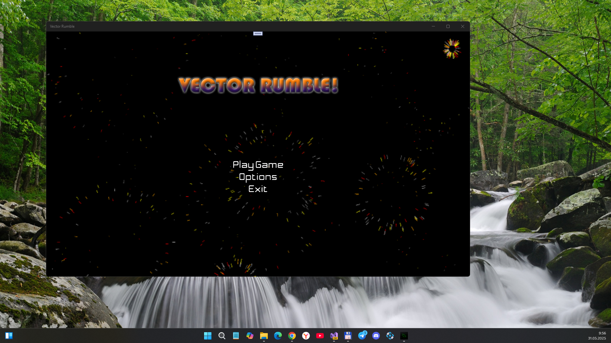
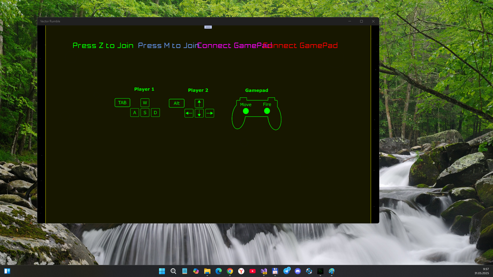
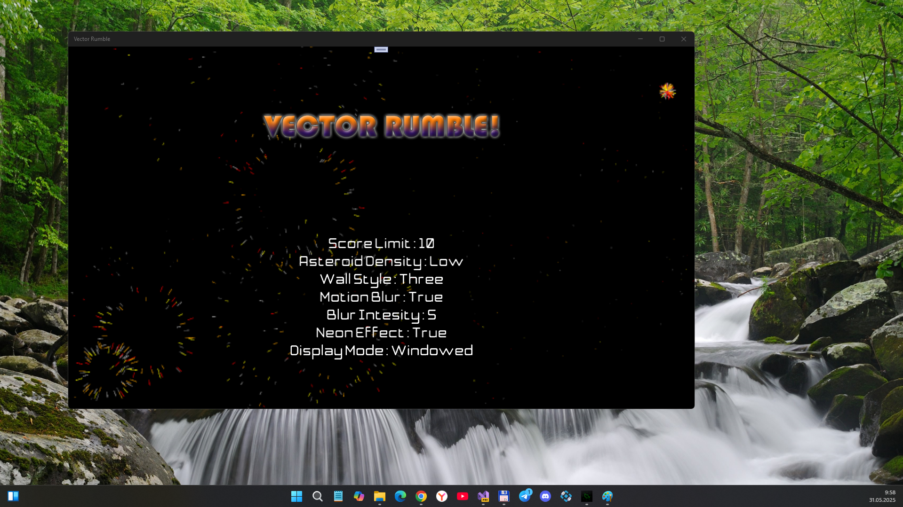
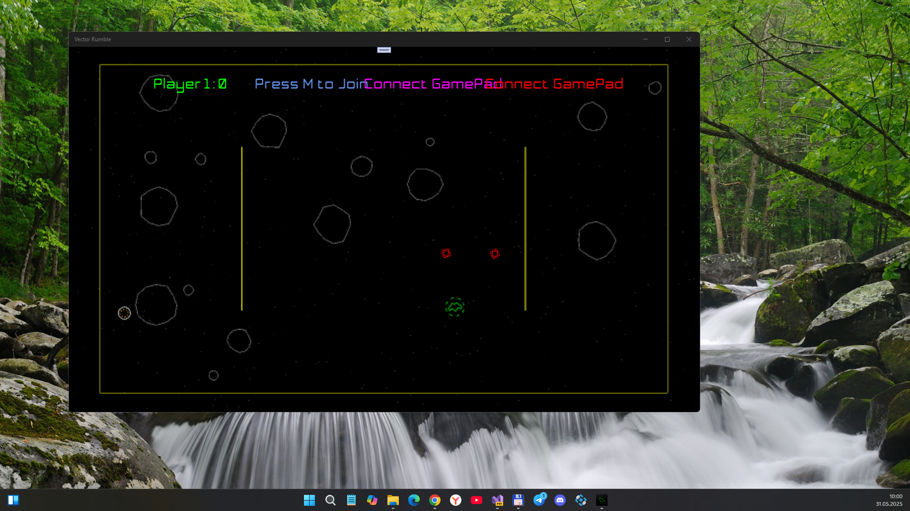
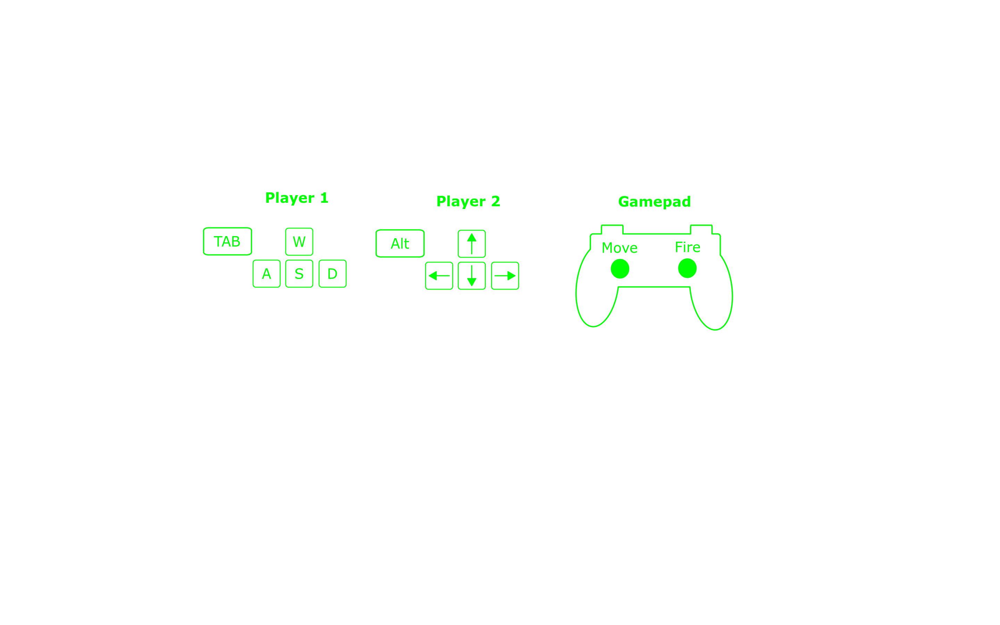

# VectorRumble

My fork of MonoGame "UWP-port" of the XNA VectorRumble Sample for my own micro-research (screens tech, multi-player mode, etc.)

## About
"A fast paced 4 player (2 game-pads + 2 keyboard), 2 dimensional, top-down shooter.
Battle your friends to the death in several arenas, full of asteroids and power ups. 

This is an enhanced version of an old XNA sample, ported to the MonoGame framework, due to it’s cross-platform support.Enhancements:

You can now create your own custom arenas and ship designs (for now by hand).
More enhancements coming in future releases, including an arena and ship editor."

## Screenshot(s)

## Tech details
- My remake made:        May 31, 2025
- Original updated:	 May 24, 2025
- Original Published:	 Oct 18, 2017
- Status:	         In development
- Platforms:	         Windows 10/11 Desktop, Windows 10 Mobile, and XBox ;)
- Author of original:	 infinitespace-studio
- Janre:	         Action
- Builded with:	         MonoGame
- Labels: Retro, Action
- Game session:	A few minutes
- Language(s):	English
- Game control:	Keyboard, Gamepad, XBox controller (?) 
- UWP app : Min Win. SDK is 10240, Main Win. SDK is 14393  

## Controls

## ToDo
- Fix game screen-scaling on any W10M-based flagman (Lumia 950 / 950XL) or hi-def UWMP
- Improve touch control, add new swipes (main menu, gameplay)
- Fix game storage (score?)
- Made single-player mode (AI enemy needed)))

## .
As is. No support. DIY. Learn purposes only.

## Reference(s)
- https://infinitespace-studios.itch.io/vector-rumble Original project (windows, ios, etc.)
- https://github.com/infinitespace-studios/VectorRumble Src code of Original project (uwp port, desktop case, etc.)
- https://github.com/infinitespace-studios Author of VectorRumble "uwp port" :)

## ..
[m][e] *May, 31 2025*
